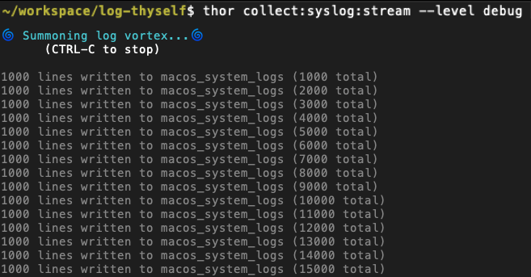

# Computer, Log Thyself!



### What Does It Do?

It backloads as well as real-time streams a whole bunch of MacOS log sources into a postgres database where they can be analyzed far more easily. Useful if you think you're being monitored/hacked/etc - but probably has other uses too. Currently supports:

1. MacOS unified syslogs.
1. Logs generated by [Objective-See's tools](https://objective-see.org/products/utilities.html) that extract/publish the data from Apple's new Endpoint Security Framework.
1. Older ASL apple logging system1
2. Various compressed files
3. `.pklg` bluetooth/TCP dumps
4. Any arbitrary collection of files you consider a log, really.

### Why would I want to do this?
I wrote this because I was suspicious that my macs were being hacked. MacOS only keeps ~5-60m of logs on hand depending on what you're doing, even less if you use the more verbose logging style. And they aren't in a particularly easy to analyze format either.

For those of us who know how to interact with an SQL database having the data available in this form makes analysis much, much easier. Also I suspect if you hire a security professional to audit your system because you fear you've been hacked, the people you hire will love you if you can give them this data.

I also suspect this could be pretty useful to people developing applications for MacOS.

# Installation

1. Checkout or download the code. For the less git enabled among us, click the green "Code" button above, click "download zip" or similar, and unzip it. (_Advice you don't have to take: put the resulting folder somewhere sensible._)
2. If you have `homebrew`, `ruby 3.1`, and `postgresql` setup already, skip to the next step. If you _don't_ have those things (of if you have no idea what those things are), don't worry, we can still do this. There's a script that should set up everything for you but you have to get in Terminal and run it.
    1. Go to the `Applications/Utilities` folder on your Mac.
    2. Click `Terminal`. (If you've never run terminal before, congratulations: you are now officially inside your computer)
    3. Change the current directory (AKA "folder") in Terminal by typing `cd ` and then dragging the folder you downloaded this to onto the terminal. It should populate a bunch of text - the location of the folder you dragged in. Press enter and your terminal window will be in a new directory.
3. Run `scripts/initial_setup.sh` from the project directory. This will (hopefully) install the prerequisites and set up the database.

Beyond that:
* If you want to collect the Apple Endpoint Security Framework data you will also need to install [Objective-See's tools](https://objective-see.org/products/utilities.html).
* If you want to read the bluetooth logs that are created as "old style" logs you will need to install Wireshark (`tshark`, specifically, which comes with it).  `brew install --cask wireshark` should do it.

#### Installation As A Continually Running Process Managed By `launchd`

It's not necessary but you can set things up so the MacOS log stream collection launches right when you power on your computer - before you even login - for maximum monitoring power. Apple's `launchd` will also relaunch the log collector should it crash if you set this up.

Install it with `sudo thor system:daemon:install`. (You will be prompted for your password; only the root user can install launch daemons).

**NOTE:** If you want options other than the defaults, you'll have to edit [the launch script](scripts/launch.sh).

### Uninstallation
Copy paste this stuff into the terminal:

```sh
sudo thor system:daemon:uninstall
# Drop the database
psql << 'DROP DATABASE macos_log_collector_development'
psql << 'DROP DATABASE macos_log_collector_test'
psql << 'DROP DATABASE macos_log_collector'
```

Then delete the project folder. Uninstalling `ruby`, `homebrew`, `postgres` etc. is beyond the scope of this readme but you can figure it out.

-------

# Usage
**QUICKSTART:** This should start streaming macOS system logs to the database.

```sh
thor collect:syslog:stream
```

### Other Kinds Of Usage

The Quickstart shows you how to capture `info` level logs in a stream going forward from "now" but the application can also capture logs from the past (if OS X hasn't purged them yet), read logs from files, and a bunch of other stuff. The interface is built in Thor (which I mildly regret[^1], but not enough to change it), the same thing as Ruby on Rails's generators. Type `thor list` and you should see something like this:

[^1]: I've never seen a project used by so many people (everyone who uses rails uses it, even if they don't know it) with such a combination of broken features and atrocious - nay, profanely misleading - documentation. It's a good library in some ways but given the issues with figuring out how to use it it's like they want you to not use it.

```sh
collect
-------
thor collect:consolelogs:load          # Load old logging system files that will no longer be written to
thor collect:consolelogs:load_dir DIR  # Load all files in directory DIR. They don't even have to be log files - Will unzip and process many compressed formats as well as wi...
thor collect:consolelogs:stream        # Stream old system logs from the filesystem (mostly the ones seen in Console.app)
thor collect:syslog:custom ARGUMENTS   # ARGUMENTS will be passed to the 'log' command directly (with great 💪 comes great responsibility)
thor collect:syslog:from_file FILE     # Read logs from FILE. Can handle non JSON log formats, see the help.
thor collect:syslog:last INTERVAL      # Capture from INTERVAL before now. Example INTERVALs: 5d (5 days), 2m (2 minutes), 30s (30 seconds)
thor collect:syslog:start DATETIME     # Collect logs since a given DATETIME in the past using 'log show'
thor collect:syslog:stream             # Collect logs from the syslog stream from now until you tell it to stop

collecthor
----------
thor collecthor:everything  # Collect all the things (future and past) in forked processes
thor collecthor:future      # System Logs, FileMonitor, ProcessMonitor from now (requires sudo!)
thor collecthor:past        # System logs from the past + Console/ASL logs,

db
--
thor db:dump  # Write the database to a compressed archive via pg_dump.

objectivesee
------------
thor objectivesee:file_monitor:stream     # Collect file events from FileMonitor (requires sudo!)
thor objectivesee:process_monitor:stream  # Collect process events from ProcessMonitor (requires sudo!)

system
------
thor system:daemon:disable    # Disable the daemon permanently
thor system:daemon:enable     # Enable the daemon
thor system:daemon:install    # Install as a launchd daemon (requires sudo)
thor system:daemon:start      # Start the daemon
thor system:daemon:status     # See what the launchd manager thinks abouut your daemon
thor system:daemon:stop       # Stop the daemon (it may return when you reboot unless you :disable or :uninstall it)
thor system:daemon:uninstall  # Uninstall the daemon (:enable will be run to purge it it even from the dissabled list)
```

------

Thor will show you the command line options for each command via `thor help COMMAND`.  e.g. `thor help objectivesee:process_monitor:stream` yields something like
```sh
$ thor help objectivesee:process_monitor:stream

Usage:
  thor objectivesee:process_monitor:stream

Options:
  [--executable-path=EXECUTABLE_PATH]        # Path to your ProcessMonitor executable
                                             # Default: /Applications/ProcessMonitor.app/Contents/MacOS/ProcessMonitor
  [--app-log-level=LEVEL]                    # This application's logging verbosity
                                             # Default: INFO
                                             # Possible values: DEBUG, INFO, WARN, ERROR, FATAL, UNKNOWN
  [--batch-size=N]                           # Rows to process between DB loads
                                             # Default: 10000
  [--avoid-dupes], [--no-avoid-dupes]        # Attempt to avoid dupes by going a lot slower
  [--read-only], [--no-read-only]            # Just read and process the streams, don't save to the database.
  [--command-line-flags=COMMAND_LINE_FLAGS]  # Flags to pass through to executable command line (-pretty is not allowed)
                                             # Default: -skipApple
  [--read-from-file=READ_FROM_FILE]          # Read from the specified file instead of streaming from the application

Collect process events from ProcessMonitor (requires sudo!)
```


### Configuration
#### Event Filtering
[Filter definitions are here](config/log_event_filters/filter_definitions.rb); they can be edited as you like. The default is to all most thing. Because the filters are ruby code you can write rules that block events matching any set of properties or allow some random percentage of certain kinds of event through or use whatever rules you want - sky's the limit.

Other than that it's mostly configured from the command line but you can set some custom configuration options if you make your own `.env` file.  Start by copying the examples: `cp .env.example .env`.

#### Application Logging
**This section is not about the system logs this app is capturing.** Those are written to the database. This is about the logs this application generates. _This application's_ logs are by default written to the `log/` directory in the project's root dir.  If things aren'y working, look there and maybe you'll be able to figure out what's wrong.

You can use the `RAILS_LOG_TO_STDOUT` environment variable to have them printed to `STDOUT` (AKS "the terminal window you are looking at") in real time.  e.g. you would run the stream loader like this:

```sh
RAILS_LOG_TO_STDOUT thor collect:syslog:stream
```

-------

# Analyzing The Data
`QUICKSTART (sort of)`: Query the database with SQL. There's some [useful queries](db/queries) in the repo you can look at/imitate.

If you don't know how to write SQL queries the best thing to do would be to point a tool like Chartio at the database, which will give you some kind of GUI / charting situation. You could also use `thor db:dump` to dump out the data to a CSV and load it in even something like Excel (on the small end) or AWS Athena (on the high end).

If you know minimal SQL a tool like [pgAdmin](https://www.pgadmin.org) may or may not be helpful. There may be other, better tools out there as well. Feel free to suggest others. Beyond that analysis is kind of on you or whichever database wizards you can round up to look at your situation.

As far as what to look for... it's hard. There's a lot of stuff in there that looks scary but is totally benign. Developers tend to leave log messages in their code long past their usefulness and with extra scariness. Here's my personal favorite from Apple's syslogs:

```
ERROR: bluetoothd (367) is not entitled for com.apple.wifi.events.private, will not register for event type 130
```

Totally benign, I swear.

Personally I focus on querying the data for words like "camera" and "microphone" or stuff about new users, failed logins, open ports, etc. looking for I recommend the [Objective-See](https://objective-see.org) website/blog.  They have many great resources to read and tools to download.


### System Logs

Run `man log` to read Apple's documentation of what is in the system logs ([here](https://www.dssw.co.uk/reference/log.html) is a link to the log manual that may or may not be current).

> NOTE: You can get some profiles that de-privatize (remove the `<private>` string and replace it with something more meaningful from apple [here](https://developer.apple.com/bug-reporting/profiles-and-logs/?platform=macos). Deprivatizing all of them is harder, but you can read [this](https://developer.apple.com/forums/thread/676706).

Your data will be in a database called `macos_log_collector`, in a table called `macos_system_logs`. It has _everything_ apple provides (or claims to provide). It also has a special index on the `event_message` which makes querying for strings blindingly fast in some cases, as long as those strings are longer than 3 characters (the longer the betters). The table has these columns:

| Name  | Data Type | Comment |
| ------------- | ------------- | --- |
| `log_timestamp` | _datetime_ | |
| `event_type` | _string_ | See Enums section below |
| `message_type` | _string_ | See Enums section below |
| `category` | _string_ | |
| `event_message` | _string_ | **The actual log message text** |
| `process_name` | _string_ | **Process that generated the event** |
| `sender_process_name` | _string_ | **Process that reported the event, often a library used by the actual proces** |
| `subsystem` | _string_ | e.g. `com.apple.authkit` |
| `process_id` | _string_ | |
| `thread_id` | _string_ | |
| `trace_id` | _decimal_ | [Reverse engineering here, maybe](https://github.com/libyal/dtformats/blob/main/documentation/Apple%20Unified%20Logging%20and%20Activity%20Tracing%20formats.asciidoc#26-compressed-data) |
| `source` | _json_ | Which library (and even sometimes which line of code) is responsible for the event. Requires the `--source` option (now on by default) |
| `activity_identifier` | _string_ | ??? |
| `parent_activity_identifier` | _decimal_ | ??? |
| `backtrace` | _json_ | ??? |
| `process_image_path` | _string_ | Full filesystem path to `process_name` |
| `sender_image_path` | _string_ | Full filesystem path to `sender_process_name` |
| `boot_uuid` | _string_ | Unique identifier of either your computer or your current login session? |
| `process_image_uuid` | _string_ | UUID of process image |
| `sender_image_uuid` | _string_ | UUID of sender image |
| `mach_timestamp` | _bigint_ | ??? |
| `sender_program_counter` | _bigint_ | ??? |
| `timezone_name` | _string_ | ??? |
| `creator_activity_id` | _decimal_ | ??? |


#### System Log Enums
There are fundamentally two kinds of log messages - events and log messages (which are classified as a kind of event: a `logEvent`). There are two ENUMs to save space when storing the `event_type` and `message_type`. Apple has kind of gone their own way as far as logging levels (as they do with basically everything - though I'm still amazed they did it with _log levels_) so we're kind of on our own figuring out what's what.

That said, assuming the order is `Debug`, `Info`, `Default`, `Error`, `Fault`[^2], then you can use greater than/less than comparators. e.g. `SELECT * FROM macos_system_logs WHERE message_type > 'Default'` would show you all the `Error` and `Fault` entriees.

[^2]: What happened to `Warn`?

| **event_types** | **message_types** |
|------------|------------|
| activityCreateEvent | Debug
| activityTransitionEvent | Info |
| logEvent | Default |
| stateEvent | Error |
| signpostEvent | Fault |
| timesyncEvent |  |
| traceEvent | |
| userActionEvent | |

-------

### The Simplified View Of The System Logs
I have learned that a lot of the columns Apple provides are actually pretty useless and/or empty, so there is also a view of the table `simplifed_system_logs` you can query that has only the most important columns.

| Name  | Data Type | Comment |
| ------------- | ------------- | --- |
| `L` | _char_ | Collapses the two enums to one character. [See here for details](db/functions/msg_type_char_v02.sql) |
| `log_timestamp` | _datetime_ | |
| `process_name` | _string_ | Process that generated the event |
| `sender_process_name` | _string_ | Process that reported the event, often a library used by the actual proces |
| `category` | _string_ | e.g. `WindowServer` |
| `subsystem` | _string_ | e.g. `com.apple.authkit` |
| `event_message` | _string_ | **The actual log message text** |


### Objective-See `FileMonitor` Data

The table is called `file_events`. Everything is not extracted but the original JSON data structure is stored in the database where [you can directly query it](https://www.postgresql.org/docs/12/functions-json.html) if you are familiar with the dark art of querying JSON paths via SQL queries.  See [Apple's Endpoint Security Framework documentation](https://developer.apple.com/documentation/endpointsecurity) for more info on what the data is.

-------

# Development/Contributions
Contributions are welcome. Stuff I'm working on includes filtering, pre-unified MacOS syslogging, and a couple other things.

BTW If you're thinking to yourself, "well I only know python, I can't contribute" - let me just say that having worked with Ruby, Python, and 10-20 other languages in a professional capacity: if you know one you basically know the other.  The differences are very small compared to the differences between other languages.

If you're familiar with computers but not familiar with Ruby or Rails: this is barely a Rails app. It doesn't use Rails in the way god and man intended. But it was generated from the Rails startup script so there's a bunch of cruft. Let me point you to the very few places that matter in this monstrous default directory structure. I left the cruft there for now, on the off chance that someone wants to make some kind of frontend for this or whatever... Rails is pretty good at facilitating database interactions, even when not used as intended.

* [app/models/](app/models) (Objects related to database tables, mostly)
* [db/queries/](db/queries) (where i've been putting queries i found useful)
* [lib/](lib) (stream parsers, Thor code)
* [scripts/](scripts) (scripts to install things and start things)


### Running The Test Suite
```sh
bundle exec rspec
```

Test should pass before you open a pull request. New featuers should have tests... that pass.


-------

## Other Resources
* Eclectic Light
* [postgres_dba](https://github.com/NikolayS/postgres_dba)

## features?
1. dump discarded events to disk

